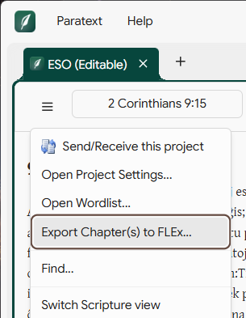
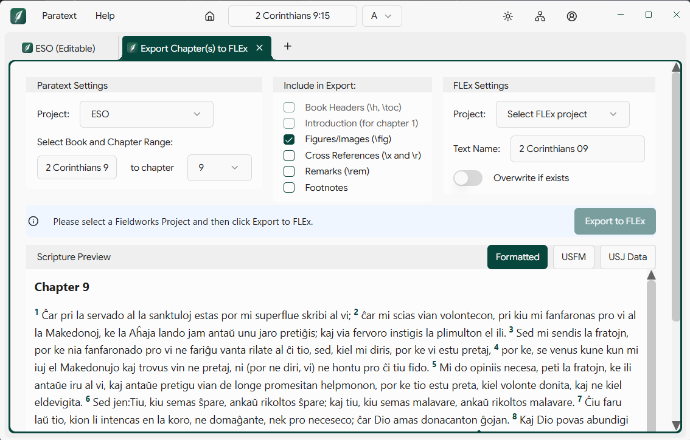

# P10-Export-FLEx

A Paratext 10 Studio extension that exports Scripture texts to FieldWorks Language Explorer (FLEx) for linguistic analysis.

It replaces the older workflow of running FLExTools' `ImportFromParatext` module: instead of switching tools, you select books and chapters from inside Paratext and the text appears in your FLEx project — already tagged with the correct writing systems.

## Why use this?

If you're translating Scripture and using FLEx for word-level analysis (lexicon, parsing, glossing), you eventually need the translated text to land in FLEx. Doing this manually — or via the legacy FLExTools import — has historically been clunky and error-prone:

- The two tools live in separate windows and require leaving Paratext to drive the import.
- Writing-system tagging is easy to get wrong, which corrupts analysis downstream.
- Re-imports after edits in Paratext require redoing the whole flow.

This extension does the export in one step, from the Paratext panel you're already working in. Scripture content is tagged with the **vernacular** writing system you choose; SFM markers, verse references, and chapter numbers are tagged with the **analysis** writing system, matching FLEx convention.

## Requirements

- **Paratext 10 Studio v0.3 or later.** v0.5 is recommended for the smoothest experience (some status messages and navigation behavior assume v0.5+ APIs).
- **FieldWorks 9** installed locally. The extension talks to FLEx through `SIL.LCModel`, which ships with FieldWorks.
- **Windows.** The bridge that writes to FLEx projects is .NET 4.8 and currently Windows-only.

## Installation

1. Download `flex-export_<version>.zip` from the [Releases page](../../releases).
2. Extract the contents to one of these locations (whichever your install uses):
   - **Paratext 10 Studio:** `%LOCALAPPDATA%\Programs\paratext-10-studio\resources\extensions\flex-export`
   - **platform-bible (newer installs):** `%LOCALAPPDATA%\Programs\platform-bible\resources\extensions\flex-export`
3. Restart Paratext Studio.

After restart, the menu item **Export Chapter(s) to FLEx** appears under the Project menu of any open Scripture editor.

## Using the extension

### Opening the export panel

From inside any Scripture editor in Paratext, open the project menu and choose **Export Chapter(s) to FLEx**. The export panel opens in a new tab. The currently-active Paratext project and book/chapter reference are pre-selected; you can change either.



### Configuring an export

The panel has three columns of controls, plus a status strip and a Scripture preview below.



**Paratext Settings (left column)**
- **Project** — source of the Scripture text. Resources (read-only projects) are not exportable; if you launch the panel from a resource you'll see a notice and need to pick an editable project.
- **Book and chapter range** — pick the book, then a single chapter or a range. Psalms uses 3-digit chapter padding in the generated text name; everything else uses 2 digits.

**Include in Export (middle column)**

Toggles for which marker types are carried into FLEx:
- Book Headers (`\h`, `\toc`)
- Introduction (intro markers in chapter 1)
- Figures/Images (`\fig`)
- Cross References (`\x` and `\r`)
- Remarks (`\rem`)
- Footnotes

The `\id` line is always emitted to keep FLExTrans-style imports compatible.

**FLEx Settings (right column)**
- **Project** — discovered automatically from your FieldWorks projects directory. The dropdown shows all projects with their default vernacular and analysis writing systems.
- **Text Name** — auto-generated from the book and chapter range (e.g. `2 Corinthians 09`). Fully editable. If a text with that name already exists in FLEx, you'll be offered the next available name or the option to overwrite via the **Overwrite if exists** toggle.
- **Writing system** — appears after a FLEx project is selected. Defaults to the project's vernacular WS; override per-export if your project has multiple vernacular writing systems (e.g. an Arabic project with a transliteration WS).

**Scripture Preview**

Below the controls, the panel shows what will actually be sent to FLEx. Toggle between **Formatted** (rendered scripture), **USFM** (raw markers), and **USJ Data** (the JSON payload the bridge consumes) to verify your filters look right before exporting.

### What you'll see at the bottom

A unified status strip surfaces the things that commonly block an export:

- **Project locked** — FLEx has the project open with sharing disabled. You'll need to enable sharing in FLEx (`Tools → Project Sharing`) or close FLEx, then retry.
- **Sharing disabled** — same root cause; the extension can read project metadata but can't write.
- **Verify timeout** — after creating the text the extension does a passive check that it's accessible. If FLEx is mid-write, this can time out and you'll see a warning rather than a failure.
- **Resource not exportable** — the active Paratext project is a resource and can't be the source of an export.

### After export

The success message tells you how many scripture paragraphs were written and offers an **Open in FLEx** button. The button uses a FLEx deep link to navigate FLEx straight to the new text.

## Diagnosing problems

### Bridge log file

Every time the FLEx bridge runs, unhandled errors are written to a rotating daily log:

```
%LOCALAPPDATA%\SIL\P10-Export-FLEx\logs\bridge-YYYYMMDD.log
```

The log contains full stack traces. *Handled* errors (project locked, text exists, invalid GUID format) don't write to the log because they're already conveyed in the export panel — only unexpected failures do. Logs are pruned automatically after 30 days.

If you file a bug, attaching the most recent log entry is usually enough to debug.

### Common issues

| Symptom | Likely cause |
| --- | --- |
| FLEx project dropdown is empty | FieldWorks 9 is not installed, or has no projects in `%PROGRAMDATA%\SIL\FieldWorks\Projects\`. |
| "Project is locked" | FLEx is open with this project and sharing is off. Enable Project Sharing in FLEx, or close FLEx. |
| "Project needs migration" | The project hasn't been opened in FLEx since a FieldWorks upgrade. Open it in FLEx once, then retry. |
| Export succeeds but the text doesn't appear in FLEx | FLEx may not have refreshed; try `View → Refresh` in FLEx. If the text really wasn't created, the bridge log will tell you why. |
| Menu item missing after install | Verify the extension landed in the right `extensions/flex-export` directory; restart Paratext Studio fully (not just the window). |

## Reporting bugs

File issues at https://github.com/MattGyverLee/P10-Export-FLEx/issues. Helpful info to include:

- Paratext 10 Studio version
- FieldWorks version
- Steps to reproduce
- Relevant entries from `bridge-YYYYMMDD.log`

## Project structure

```
P10-Export-FLEx/
├── extension/                # TypeScript Paranext extension
│   ├── src/
│   │   ├── main.ts                        # Extension entry: command + WebView registration
│   │   ├── services/flex-bridge.service.ts # Wraps the C# bridge over stdin/stdout JSON
│   │   ├── web-views/welcome.web-view.tsx # Export panel UI
│   │   └── __tests__/                     # Jest tests (128 tests / 6 suites)
│   ├── contributions/
│   │   ├── menus.json                     # "Export Chapter(s) to FLEx" menu entry
│   │   └── localizedStrings.json          # UI strings
│   ├── scripts/deploy.js                  # Deploys dist/ to the local Paratext install(s)
│   └── manifest.json                      # Extension manifest
│
├── bridge/FlexTextBridge/    # C# .NET 4.8 CLI
│   ├── Commands/             # One class per --flag (list, info, create, verify, etc.)
│   ├── Services/             # FLEx project access, USJ→USFM, logging
│   └── Models/               # JSON DTOs shared with the extension
│
├── scripts/release.ps1       # Build + publish a GitHub release
├── CHANGELOG.md
└── DEVELOPER.md              # Setup, build, deploy, release docs
```

## Documentation

- **[CHANGELOG.md](./CHANGELOG.md)** — release history with feature/fix highlights per version.
- **[DEVELOPER.md](./DEVELOPER.md)** — clone, build, deploy, test, release.
- **[CLAUDE.md](./CLAUDE.md)** — architecture and component reference (kept in sync with the code).

## License

MIT. See [LICENSE](./LICENSE).

## Credits

P10-Export-FLEx is a SIL International project. The export logic and writing-system tagging conventions are based on the FLExTrans `ImportFromParatext` module — credit to that team for figuring out the right way to do this in the first place.
